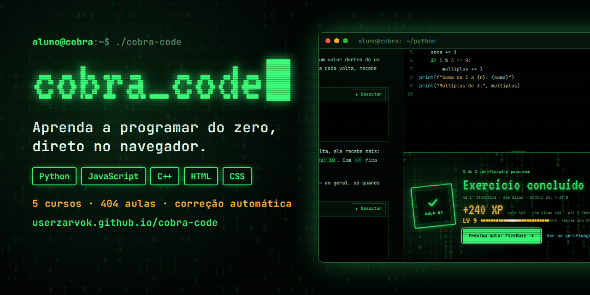
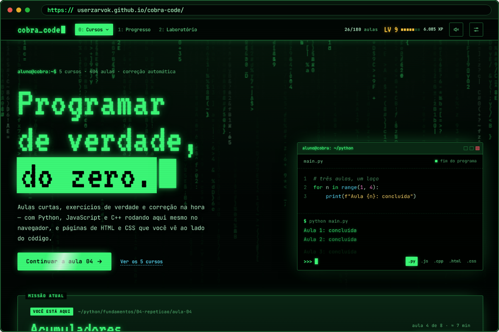
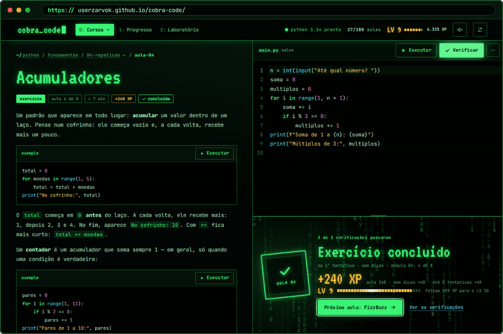
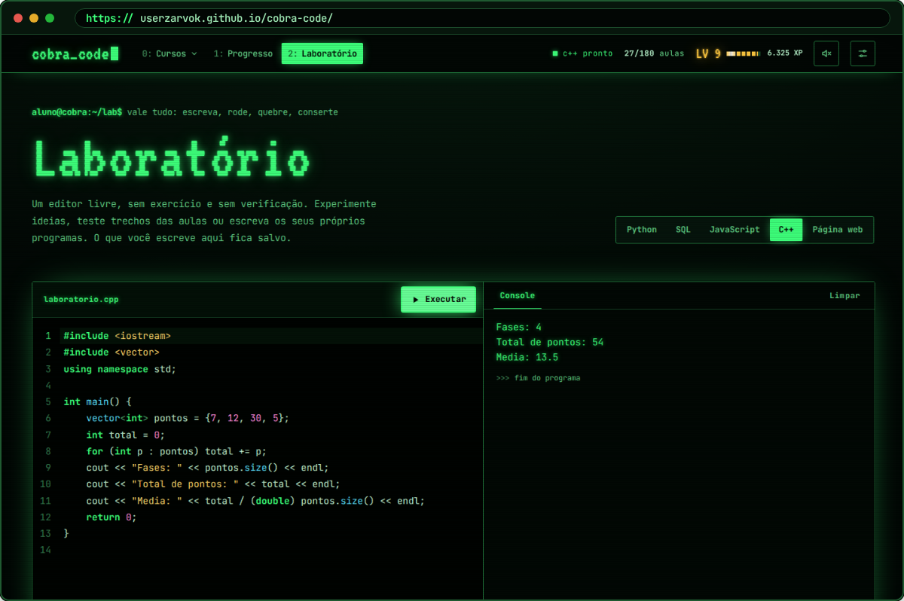
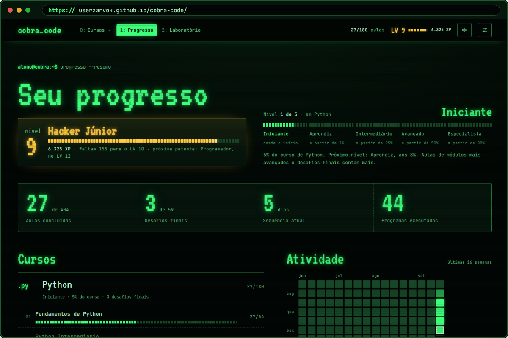

 

**Cobra Code** é um curso de programação completo que roda inteiro no navegador. Você lê a aula, escreve o código num
editor de verdade, clica em **Executar** e depois em **Verificar**: a correção acontece na hora, ali mesmo, sem instalar
nada e sem servidor.

## O que tem dentro

| Curso | Aulas | Do que trata |
|---|---:|---|
| **Python** | 180 | Do primeiro `print()` a jogos, banco de dados, testes e back-end |
| **HTML** | 44 | A estrutura de toda página: textos, links, imagens, tabelas e formulários |
| **CSS** | 53 | Cores, texto, box model, Flexbox, Grid, páginas responsivas e animações |
| **JavaScript** | 66 | Do `console.log` a classes, código assíncrono, DOM e um jogo |
| **C++** | 61 | Compilar de verdade: tipos, funções, `vector`, classes, ponteiros, STL e templates |

## Destaques

- **Linguagens de verdade no navegador**: Python 3, JavaScript e C++ compilado, todos em WebAssembly. Nas aulas de HTML
  e CSS, a página aparece ao lado do código.
- **Correção automática** que explica o erro em português e aponta a linha. Uma saída quase igual passa com uma dica
  (e dá para ligar a correção rigorosa).
- **Visual de terminal**: fósforo verde, chuva de código, XP, níveis, patentes, combos e conquistas.
- **Laboratório** livre para testar qualquer ideia em Python, SQL, JavaScript, C++ ou página web.
- **Som de teclado mecânico** sintetizado, em quatro estilos (opcional).
- **Funciona no celular** e guarda o progresso no próprio navegador.

## Telas

<table>
  <tr>
    <td width="50%"></td>
    <td width="50%"></td>
  </tr>
  <tr>
    <td align="center">Início: cursos, missão atual e o terminal que se digita sozinho</td>
    <td align="center">Aula: editor, verificação e o painel de exercício concluído</td>
  </tr>
  <tr>
    <td width="50%"></td>
    <td width="50%"></td>
  </tr>
  <tr>
    <td align="center">Laboratório: C++ compilado e executado no navegador</td>
    <td align="center">Progresso: nível, patente, sequência de dias e atividade</td>
  </tr>
</table>

## Como funciona

Tudo acontece no computador de quem estuda, dentro do navegador:

1. A página (`index.html`) traz as aulas, o editor e a interface.
2. Ao executar, o código vai para um *worker* com o motor da linguagem:
   - **Python**: [Pyodide](https://pyodide.org), o CPython compilado para WebAssembly;
   - **JavaScript**: [QuickJS](https://bellard.org/quickjs/), um motor de JavaScript em WebAssembly;
   - **C++**: Clang e LLD em WebAssembly, que compilam o programa e o executam ali mesmo;
   - **HTML e CSS**: a página é montada num quadro isolado, ao lado do código.
3. A verificação roda os testes da aula no mesmo motor e explica o resultado.

## Estrutura deste repositório

Este repositório guarda o **site pronto**, publicado pelo GitHub Pages:

| Caminho | O que é |
|---|---|
| `index.html` | a página: aulas, editor e interface |
| `py-worker.js`, `py/` | motor de Python |
| `js-worker.js`, `js/` | motor de JavaScript |
| `cpp-worker.js`, `cpp-runner.js`, `cpp/` | motor de C++ |
| `web-engine.js` | motor das aulas de HTML e CSS |
| `midia/` | imagens e sons usados nas aulas |

## Licença

© 2026 Pedro ([@Userzarvok](https://github.com/Userzarvok)). **Todos os direitos reservados.** Você pode usar o site e ler
o código para estudar, mas não pode copiar, modificar, redistribuir nem publicar em outro lugar sem autorização.
Veja o arquivo [LICENSE](LICENSE).

Os componentes de código aberto que o Cobra Code usa (Pyodide, QuickJS, Clang/LLVM, CodeMirror, Acorn e as fontes
JetBrains Mono e VT323) continuam sob as licenças deles: veja [AVISOS-DE-TERCEIROS.md](AVISOS-DE-TERCEIROS.md).
